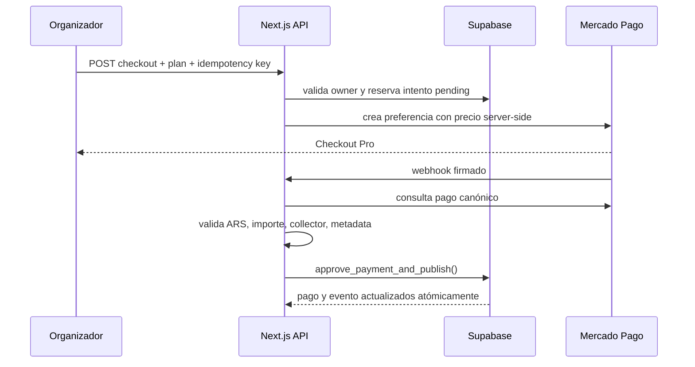
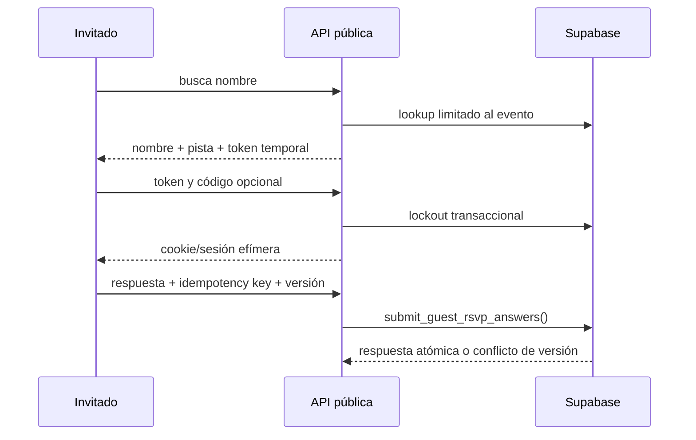

# APIs y flujos críticos

## Convenciones

- APIs privadas: `Authorization: Bearer <Supabase access token>`.
- APIs públicas: cuerpo JSON limitado, rate limit y sesión/token de invitado
  cuando corresponde.
- Respuestas de error: `{ "error": "mensaje seguro" }` y código HTTP coherente.
- Ningún cliente envía un precio confiable; el servidor lo resuelve por plan.
- Route Handlers sensibles usan runtime Node.js.

## Inventario de APIs

### Cuenta y administración

| Ruta | Métodos | Propósito |
| --- | --- | --- |
| `/api/account/role` | GET | Identidad, nombre y rol actual. |
| `/api/admin/overview` | GET | Métricas administrativas. |
| `/api/admin/payments` | GET/PATCH | Revisión de pagos manuales. |
| `/api/admin/upgrades` | GET/PATCH | Revisión administrativa de upgrades. |
| `/api/admin/events` | GET/PATCH | Consulta y publicación manual autorizada. |
| `/api/admin/users` | GET/PATCH/DELETE | Cuentas, roles y eliminación auditada. |

### Organizador y evento

| Ruta | Métodos | Propósito |
| --- | --- | --- |
| `/api/events` | GET | Listar eventos del usuario autenticado. |
| `/api/events/drafts` | POST | Crear borrador validado y slug único. |
| `/api/events/{id}/draft` | GET/PATCH | Recuperar o editar borrador propio. |
| `/api/events/{id}/media` | POST/DELETE | Carga y eliminación de medios. |
| `/api/events/{id}/guests` | GET/POST/PATCH/DELETE | Lista y grupos de invitados. |
| `/api/events/{id}/guests/{guestId}/link` | POST | Link individual secundario. |
| `/api/events/{id}/rsvp/export` | GET | Exportación compatible con el plan. |
| `/api/events/{id}/checkout` | POST | Checkout inicial idempotente. |
| `/api/events/{id}/upgrade` | POST | Checkout por diferencia de plan. |
| `/api/organizer/overview` | GET | Resumen del panel del owner. |

`/api/events/{id}/payment` está deprecada y responde `410`; el checkout válido
es exclusivamente Mercado Pago.

### Público

| Ruta | Propósito |
| --- | --- |
| `/api/public/events/{slug}` | Proyección pública del evento. |
| `/guest-lookup` | Búsqueda mínima de grupo. |
| `/guest-access` | Verificación del código. |
| `/guest-session` | Sesión efímera de invitado. |
| `/rsvp-context` | Preguntas y contexto autorizado. |
| `/rsvp` | RSVP personalizado e idempotente. |
| `/general-rsvp` | RSVP general para Premium. |
| `/gift-details` | Datos de regalo bajo control contextual. |
| `/album` | Lectura/carga del álbum compartido. |
| `/trivia` | Preguntas y envío limitado. |
| `/legacy-access` | Compatibilidad con tokens anteriores. |

### Infraestructura

| Ruta | Propósito |
| --- | --- |
| `/api/webhooks/mercadopago` | Notificación firmada y reconciliada con API. |
| `/api/health` | Liveness superficial sin configuración sensible. |

## Flujo de pago

Un doble clic reutiliza el intento pendiente. Un webhook duplicado es seguro. El
estado `approved` es monotónico. Falta implementar la reconciliación programada
para pagos cuyo webhook no llegue.

## Flujo RSVP identificado

## Flujo de borrador

El wizard persiste estado en el navegador y, tras autenticación, crea un evento.
El servidor valida título, tipo, plantilla, plan, agenda, URLs HTTPS, tema y
features compatibles. Al editar un evento publicado, el plan no puede cambiar
mediante PATCH: debe utilizarse el flujo de upgrade.
