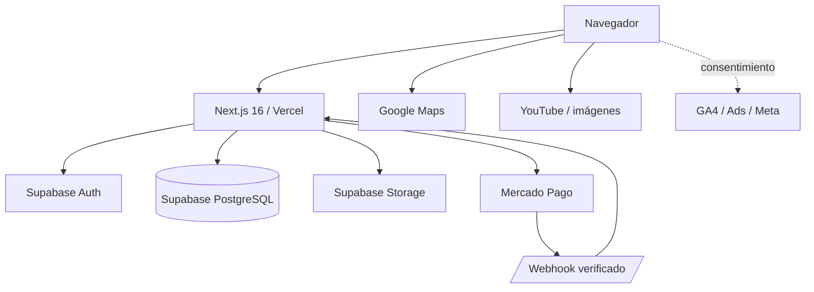

# Arquitectura del sistema

## Vista general

Papeleta es una aplicación Next.js desplegable en Vercel con Supabase como
plataforma de identidad, PostgreSQL y Storage. Mercado Pago procesa pagos B2C.

## Stack

| Capa | Tecnología |
| --- | --- |
| Runtime | Node.js 24 |
| Gestor | pnpm 11.19.0, lockfile congelado en CI |
| Aplicación | Next.js 16.3 App Router, React 19.2, TypeScript 5 |
| Hosting objetivo | Vercel |
| Datos e identidad | Supabase Auth + PostgreSQL + RLS |
| Archivos | Supabase Storage |
| Pagos | Mercado Pago Checkout Pro |
| CI | GitHub Actions |
| Medición | GA4, Google Ads y Meta Pixel tras consentimiento |
| Mapas/multimedia | Google Maps y YouTube |

## Capas lógicas

### Presentación

`app/` contiene rutas App Router, metadata, páginas públicas, paneles y Route
Handlers. `components/` contiene experiencias cliente, editor, wizard,
invitaciones, navegación y CSS por dominio.

### Dominio y contratos

`lib/` concentra planes, validadores, estados, acceso de invitados, pagos,
analítica, logging, configuración, temas y tipos. Las reglas sensibles deben
permanecer en funciones reutilizables y probables, no sólo en componentes.

### API de servidor

Los Route Handlers autentican JWT Supabase y utilizan un cliente de servidor con
`service_role`. Por ese motivo cada operación valida explícitamente owner/admin,
campos permitidos, plan y estado; `service_role` nunca autoriza por sí solo una
acción de usuario.

### Persistencia

Las migraciones `supabase/migrations/001` a `018` son la historia canónica. La
base usa constraints, RLS, grants y RPC transaccionales para invariantes que no
pueden depender de una sola instancia web.

## Superficies

### Marketing indexable

`/`, `/plantillas`, `/plantillas/{slug}`, `/precios`,
`/invitaciones/{categoria}`, `/la-armamos-por-vos`, `/partner`, `/privacidad` y
`/terminos`.

### Aplicación privada

`/crear`, `/login`, `/mis-eventos`, `/eventos/{id}/...` y `/admin/pagos`. Estas
rutas no deben indexarse.

### Invitación pública

`/e/{slug}` y funciones derivadas de álbum, trivia y RSVP. Son `noindex` por
defecto para proteger eventos de clientes.

## Principios arquitectónicos

- El servidor resuelve precio, autorización y publicación.
- Pago aprobado es monotónico.
- Un evento tiene una URL pública canónica.
- Las sesiones de invitados son distintas de la sesión del organizador.
- Las APIs públicas devuelven proyecciones mínimas.
- Los uploads se validan por bytes, dimensiones, tamaño y cuota.
- Los límites antiabuso son compartidos en PostgreSQL, no en memoria.
- Migraciones expand/contract; rollback de aplicación sin revertir datos.
- PII y secretos no ingresan a analítica ni logs.

## Decisiones relevantes

- [ADR-001](ADR-001-single-event-link.md) fija un único link público por evento.
- `lib/event-drafts.ts` es el catálogo canónico de planes.
- `lib/templates.ts` es la fuente actual de plantillas comerciales.
- Mercado Pago es el checkout B2C; pagos manuales quedan en administración.
- Vercel/Supabase staging y producción deben ser proyectos separados.

## Deuda arquitectónica conocida

- No existe todavía `supabase/config.toml` ni entorno efímero de DB en CI.
- El catálogo de plantillas está duplicado conceptualmente con tablas futuras.
- Existen componentes/CSS heredados en `components/papeleta.tsx` y múltiples
  hojas de estilos que requieren consolidación gradual.
- La aplicación usa service role en APIs; la matriz de autorización debe tener
  pruebas de integración antes de producción.
- La reconciliación programada de pagos no está implementada en el repositorio.
