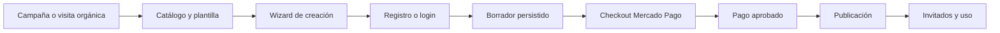

# Contexto y modelo de negocio

## Propósito

Papeleta reduce la fricción de crear, publicar y administrar una invitación
digital. La propuesta principal es autoservicio: el cliente conserva el control
del contenido y obtiene una invitación lista para compartir sin depender de un
trabajo manual del equipo.

La promesa comercial canónica es: **elegí una plantilla, cargá los datos, creá
tu cuenta, pagá y publicá**.

## Clientes y problemas

### Organizador B2C

Personas que organizan bodas, XV, cumpleaños, fiestas infantiles o eventos
corporativos pequeños. Necesitan comunicar información, centralizar cambios y,
según el plan, administrar confirmaciones e interacción con invitados.

Papeleta ofrece diseño sin desarrollo a medida, una URL compartible, contenido
actualizable, RSVP según plan y menor coordinación manual.

### Invitado

No crea una cuenta. Consulta la invitación y usa las funciones habilitadas. Si
el evento requiere identificación, la resuelve dentro del RSVP mediante nombre
y, opcionalmente, código.

### Cliente concierge

Quiere delegar la carga. “La armamos por vos” es un servicio separado con precio
desde, alcance y plazo acordados; no convierte el autoservicio en trabajo manual
por defecto.

### Partner B2B

Profesionales o empresas que producen eventos. Es un canal independiente del
checkout B2C y puede operar con condiciones y pagos manuales acordados.

## Fuentes de ingreso

1. Venta B2C de un plan por evento mediante Mercado Pago.
2. Upgrade de un evento publicado por la diferencia entre planes.
3. Servicio concierge con precio “desde” y alcance cotizado.
4. Canal Partner B2B bajo acuerdo separado.

No forman parte del funnel B2C canónico las transferencias, señas o cuotas no
garantizadas. La administración conserva publicación por transferencia para
operaciones autorizadas de concierge o partner.

## Embudo principal

Eventos analíticos definidos: `campaign_visit`, `template_view`, `create_start`,
`wizard_step_completed`, `signup_completed`, `draft_created`,
`checkout_started`, `payment_approved`, `event_published`, `whatsapp_clicked` y
`concierge_lead`. Sólo se envían tras consentimiento y nunca contienen PII.

## Métricas

- Conversión entre cada etapa del embudo.
- Tiempo desde creación hasta publicación.
- Recuperación de borradores y abandono por paso.
- Pagos pendientes, fallos de checkout/webhook y publicaciones fallidas.
- Eventos y upgrades por plan.
- Confirmaciones y participación por evento.
- Leads y cierre de concierge/partner.
- p75 LCP ≤ 2,5 s, INP ≤ 200 ms y CLS ≤ 0,1.
- 5xx < 2% en ventanas de cinco minutos.
- Publicación sin pago aprobado: tolerancia cero.

## Decisiones comerciales vigentes

- Moneda B2C: ARS.
- Estándar: ARS 18.000.
- Premium: ARS 23.000.
- Premium Plus+: ARS 28.000.
- Estándar no incluye RSVP.
- Mercado Pago Checkout Pro es el checkout B2C canónico.
- Una invitación sólo se publica después de pago aprobado o de una operación
  administrativa manual explícita.
- Las invitaciones de clientes son `noindex` por defecto.

Los cambios de precio o prestaciones deben comenzar en `lib/event-drafts.ts` y
actualizar pruebas, copy, datos estructurados y documentación en el mismo PR.

## Dependencias organizacionales

Antes del canary se requieren identificación legal del operador, datos fiscales
y de contacto, revisión legal, credenciales productivas, IDs de medición y
responsables nominados de lanzamiento e incidentes.
