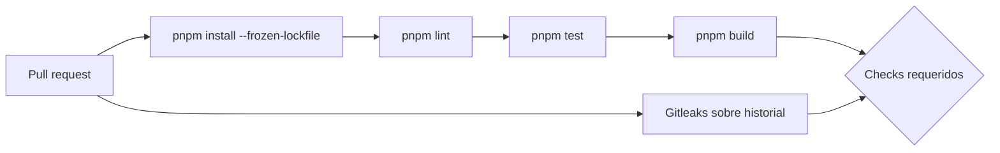
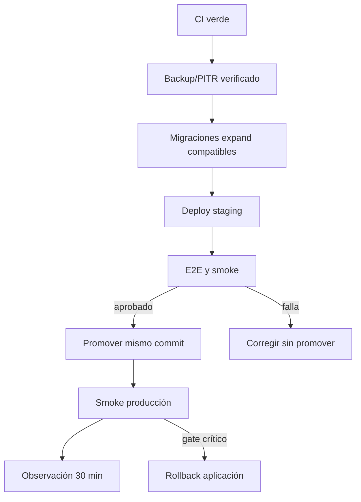

# Pipeline, entornos y despliegue

## Estado actual de CI

`.github/workflows/ci.yml` se ejecuta en pull requests y pushes a `main` y
`codex/production-audit`. Usa Ubuntu, Node 24, pnpm 11.19.0 y lockfile congelado.

Jobs actuales:

- `Typecheck, tests and build`: instalación, lint, unitarias y build. El build
  ejecuta validación TypeScript, aunque falta un paso explícito `pnpm typecheck`.
- `Secret scan`: Gitleaks con historial completo.

## Pipeline objetivo para producción

1. Instalación reproducible.
2. Lint sin errores y typecheck explícito.
3. Unitarias.
4. Migración limpia sobre Supabase/PostgreSQL efímero.
5. Upgrade desde snapshot anonimizado.
6. Tests SQL de RLS/grants/constraints/RPC.
7. Integración de APIs con matriz de autorización.
8. Build productivo.
9. E2E de funnel y Mercado Pago sandbox.
10. Axe, responsive y smoke de headers/SEO.
11. Preview Vercel por PR.
12. Aprobación y promoción del mismo commit.

Los pasos 4–10 todavía no están automatizados completamente y son gates antes
de declarar el pipeline listo para producción.

## Entornos

| Entorno | Aplicación | Datos | Pagos | Uso |
| --- | --- | --- | --- | --- |
| Local | `pnpm dev` | Supabase dev/staging | Sandbox | Desarrollo. |
| Preview | Vercel por PR | Sólo staging/dev | Sandbox | Revisión de PR. |
| Staging | Vercel integración | Supabase staging | Sandbox | E2E y canary interno. |
| Producción | Vercel `main` | Supabase producción | Producción | Tráfico real. |

Nunca compartir service role, secretos de invitados, rate limit o credenciales
de Mercado Pago entre staging y producción.

## Protección de ramas

Configurar en GitHub:

- PR obligatorio sobre `main`;
- checks requeridos de calidad y secret scan;
- una aprobación como mínimo;
- conversaciones resueltas;
- impedir force-push y borrado de `main`;
- producción sólo desde CI verde y commit exacto aprobado.

Vercel debe desplegar producción únicamente desde `main`. Las previews no pueden
usar variables ni proyectos productivos.

## Orden de release

Las migraciones se aplican antes de una aplicación que las necesita y deben ser
compatibles con la versión anterior. El rollback normal revierte la aplicación,
no destruye ni revierte la base.

## Gates de release

- CI y build verdes sobre el commit exacto.
- Migración limpia y upgrade probados.
- RLS/grants y matriz de autorización aprobados.
- Checkout sandbox → webhook → publicación completo.
- Legales, consentimiento, secretos, dominio y TLS correctos.
- Health, alertas, backups, restore y rollback probados.
- Cero P0 abiertos.

## Smoke mínimo

- `/api/health` devuelve 200 y `no-store`.
- Landing, catálogo, login y una invitación publicada cargan.
- Crear/restaurar borrador funciona.
- Upload válido funciona y uno inválido se rechaza.
- Un pago aprobado no retrocede.
- No hay PII o secretos en logs/analítica.
- Headers de seguridad y `noindex` se mantienen.

El procedimiento operativo completo está en
[deployment-runbook.md](operations/deployment-runbook.md).

## Rollback

Ante autorización cruzada, publicación sin pago, corrupción/pérdida de datos,
checkout/webhook sostenidamente roto, 5xx >2% por cinco minutos o telemetría
ausente, detener promoción y seguir
[rollback-runbook.md](operations/rollback-runbook.md).
