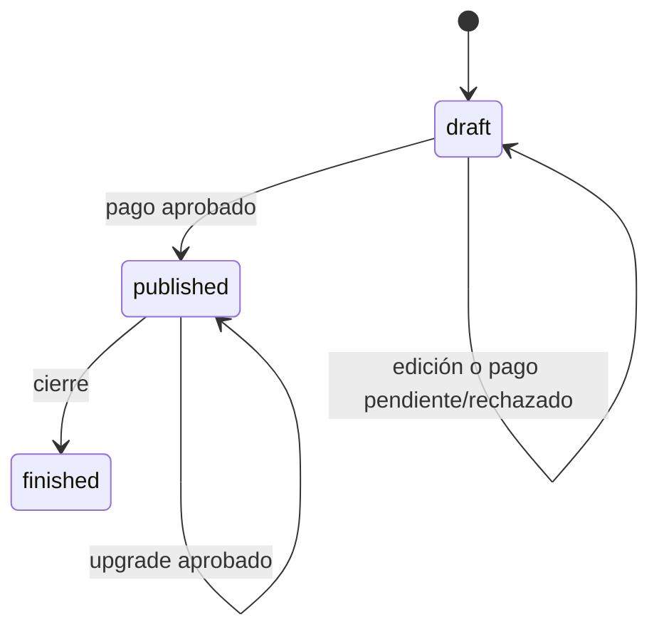

# Producto, planes y reglas comerciales

## Catálogo canónico

El tipo interno es `standard | premium | premium_plus`. Etiquetas, precios,
prestaciones y límites viven en `lib/event-drafts.ts`; ninguna interfaz debe
duplicarlos como constantes independientes.

| Plan | Precio | Medios | Capacidades principales |
| --- | ---: | ---: | --- |
| Estándar | ARS 18.000 | 1 | Portada, agenda, mapa, mensaje, dress code y regalos. Sin RSVP. |
| Premium | ARS 23.000 | 5 | Todo Estándar, galería, música, RSVP y exportación. |
| Premium Plus+ | ARS 28.000 | 10 | Todo Premium, lista, links individuales, álbum QR y trivia. |

`mediaLimit` limita la galería propia. El álbum colaborativo posee una cuota
operacional separada en la base.

## Tipos y plantillas

El catálogo cubre bodas, XV, cumpleaños, infantiles y corporativos. Las
plantillas viven hoy en `lib/templates.ts` y sus imágenes en
`public/images/templates`.

Las tablas `templates/template_versions` existen para un catálogo administrable
futuro, pero la experiencia actual consume el catálogo estático tipado. Migrar
esa responsabilidad exige un ADR para evitar dos fuentes de verdad.

## Ciclo de vida

Estados de pago:

- `unpaid`: sin intento efectivo;
- `pending`: intento reservado o en proceso;
- `approved`: monotónico, nunca vuelve atrás;
- `rejected`: permite iniciar un nuevo intento.

El plan de un evento publicado sólo cambia al aprobarse el upgrade. Los intentos
e historial se conservan en lugar de sobrescribir evidencia.

## Recorrido del organizador

1. Descubre una landing o plantilla.
2. Inicia `/crear`, conservando plantilla preseleccionada.
3. Completa contenido, lugar, agenda, visuales y funciones compatibles.
4. Inicia sesión o crea una cuenta Supabase.
5. Crea un borrador con slug único.
6. Edita y carga medios.
7. Inicia checkout; el servidor resuelve siempre el precio.
8. Mercado Pago notifica el resultado.
9. La RPC transaccional aprueba y publica.
10. Comparte `/e/{slug}` y administra el evento.

## RSVP y acceso público

La URL pertenece al evento, no a cada invitado. Modos:

- `open`: RSVP abierto;
- `name_lookup`: búsqueda segura y sesión temporal;
- `name_and_code`: búsqueda más código para eventos privados.

Los links `/e/{slug}/i/{token}` continúan para automatización, staff o check-in.
La búsqueda pública sólo devuelve nombre, pista y token firmado temporal; nunca
IDs internos, contactos, cupos, respuestas previas o códigos.

## Roles

| Rol | Alcance |
| --- | --- |
| Invitado | Acceso público, sin cuenta. |
| Organizador | Sólo eventos cuyo `owner_id` coincide con su usuario. |
| Administrador | Operaciones globales, cuentas, eventos y pagos manuales. |

La fuente de verdad es `profiles.role`. La UI consulta `/api/account/role`; la
visibilidad de enlaces nunca reemplaza la autorización del servidor.

## Ofertas complementarias

`/la-armamos-por-vos` genera leads hacia WhatsApp y `/partner` presenta el canal
B2B. Ninguno altera el precio o checkout del autoservicio sin una decisión
comercial explícita.
